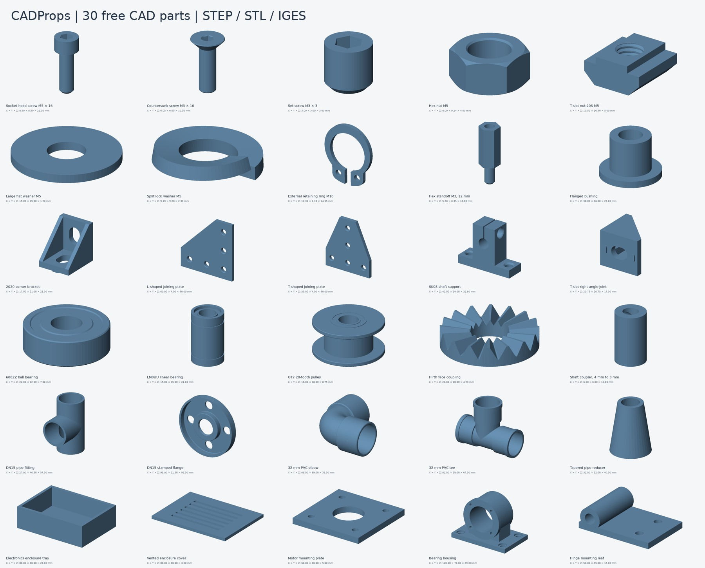
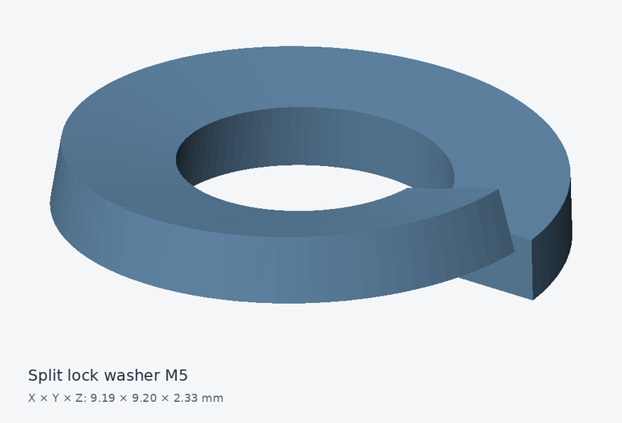
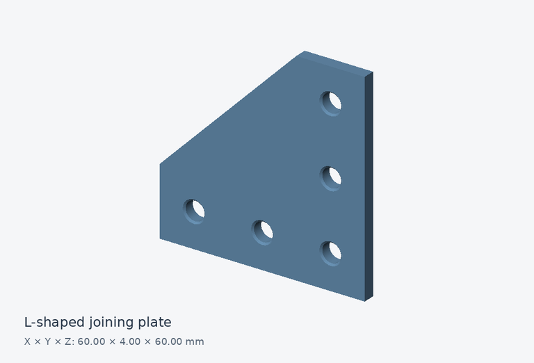
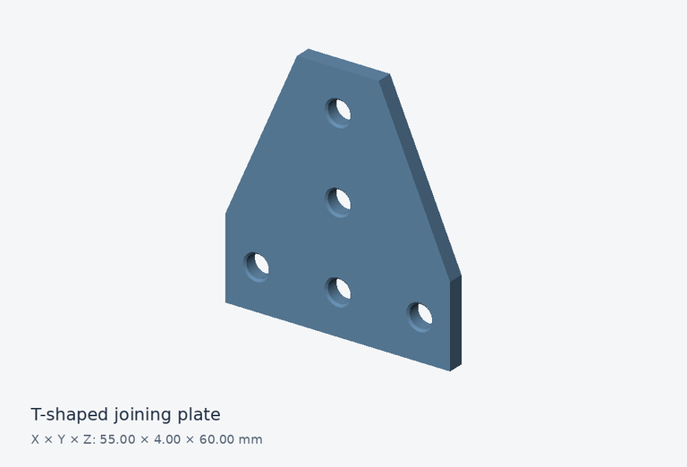
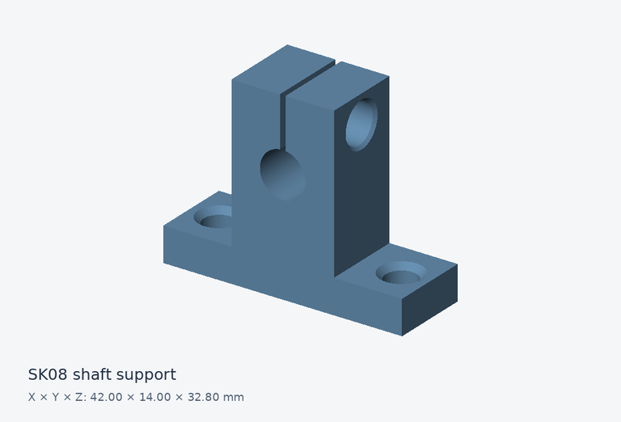
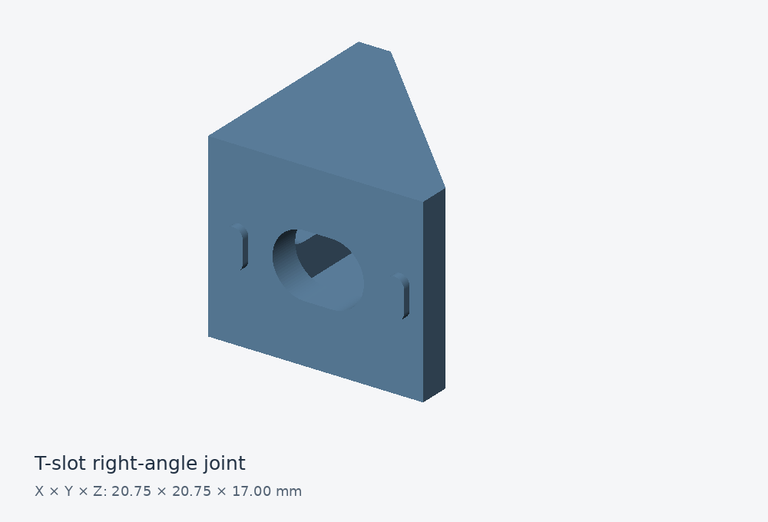
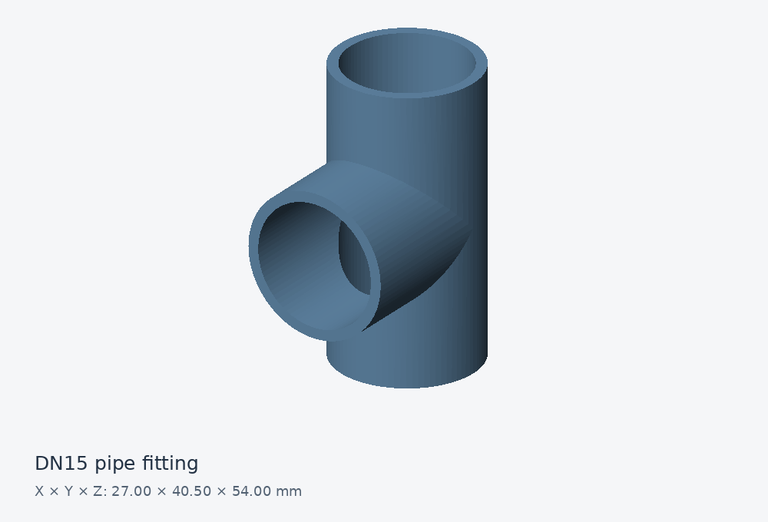
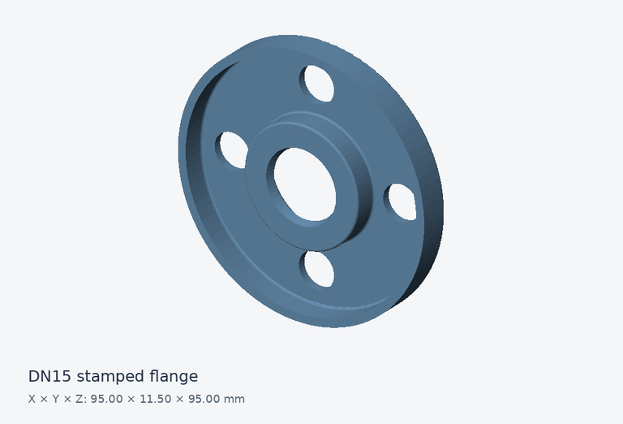

# CADProps — Free CAD Parts

A small, organized parts library for CAD layouts, learning and geometric inspection. Download **30 parts in STEP, STL and IGES**, with a real geometry preview, dimensions and a source record for every part. Curated by **CADProps**.

## Download a part

[Download the complete library as ZIP](https://github.com/cadprobs-a11y/cadprops-step-models/archive/refs/heads/main.zip). Extract it to keep the category folders and source records together.

Choose a category below. Every part folder contains a STEP model, an STL mesh, an IGES export and a short guide. Dimensions are **X × Y × Z in millimetres**; they describe the geometry actually supplied.

**23 community models** are redistributed under CC BY 3.0 with their original author credits. **7 CADProps originals** are dedicated to the public domain under CC0. Downloading does not require a CADProps account.

## Fasteners

| Preview | Part & guide | Envelope (mm) | Downloads | License |
| --- | --- | --- | --- | --- |
|  | [Socket-head screw M5 × 16](parts/fasteners/socket-head-screw-m5x16/README.md) | 8.50 × 8.50 × 21.00 | [STEP](https://github.com/cadprobs-a11y/cadprops-step-models/raw/refs/heads/main/parts/fasteners/socket-head-screw-m5x16/socket-head-screw-m5x16.step) · [STL](https://github.com/cadprobs-a11y/cadprops-step-models/raw/refs/heads/main/parts/fasteners/socket-head-screw-m5x16/socket-head-screw-m5x16.stl) · [IGES](https://github.com/cadprobs-a11y/cadprops-step-models/raw/refs/heads/main/parts/fasteners/socket-head-screw-m5x16/socket-head-screw-m5x16.iges) | CC-BY-3.0 |
|  | [Countersunk screw M3 × 10](parts/fasteners/countersunk-screw-m3x10/README.md) | 6.05 × 6.05 × 10.00 | [STEP](https://github.com/cadprobs-a11y/cadprops-step-models/raw/refs/heads/main/parts/fasteners/countersunk-screw-m3x10/countersunk-screw-m3x10.step) · [STL](https://github.com/cadprobs-a11y/cadprops-step-models/raw/refs/heads/main/parts/fasteners/countersunk-screw-m3x10/countersunk-screw-m3x10.stl) · [IGES](https://github.com/cadprobs-a11y/cadprops-step-models/raw/refs/heads/main/parts/fasteners/countersunk-screw-m3x10/countersunk-screw-m3x10.iges) | CC-BY-3.0 |
|  | [Set screw M3 × 3](parts/fasteners/set-screw-m3x3/README.md) | 3.00 × 3.00 × 3.00 | [STEP](https://github.com/cadprobs-a11y/cadprops-step-models/raw/refs/heads/main/parts/fasteners/set-screw-m3x3/set-screw-m3x3.step) · [STL](https://github.com/cadprobs-a11y/cadprops-step-models/raw/refs/heads/main/parts/fasteners/set-screw-m3x3/set-screw-m3x3.stl) · [IGES](https://github.com/cadprobs-a11y/cadprops-step-models/raw/refs/heads/main/parts/fasteners/set-screw-m3x3/set-screw-m3x3.iges) | CC-BY-3.0 |
|  | [Hex nut M5](parts/fasteners/hex-nut-m5/README.md) | 8.00 × 9.24 × 4.00 | [STEP](https://github.com/cadprobs-a11y/cadprops-step-models/raw/refs/heads/main/parts/fasteners/hex-nut-m5/hex-nut-m5.step) · [STL](https://github.com/cadprobs-a11y/cadprops-step-models/raw/refs/heads/main/parts/fasteners/hex-nut-m5/hex-nut-m5.stl) · [IGES](https://github.com/cadprobs-a11y/cadprops-step-models/raw/refs/heads/main/parts/fasteners/hex-nut-m5/hex-nut-m5.iges) | CC-BY-3.0 |
|  | [T-slot nut 20S M5](parts/fasteners/slot-nut-20s-m5/README.md) | 10.50 × 10.50 × 5.00 | [STEP](https://github.com/cadprobs-a11y/cadprops-step-models/raw/refs/heads/main/parts/fasteners/slot-nut-20s-m5/slot-nut-20s-m5.step) · [STL](https://github.com/cadprobs-a11y/cadprops-step-models/raw/refs/heads/main/parts/fasteners/slot-nut-20s-m5/slot-nut-20s-m5.stl) · [IGES](https://github.com/cadprobs-a11y/cadprops-step-models/raw/refs/heads/main/parts/fasteners/slot-nut-20s-m5/slot-nut-20s-m5.iges) | CC-BY-3.0 |

## Sleeves & washers

| Preview | Part & guide | Envelope (mm) | Downloads | License |
| --- | --- | --- | --- | --- |
|  | [Large flat washer M5](parts/sleeves-and-washers/large-flat-washer-m5/README.md) | 15.00 × 15.00 × 1.20 | [STEP](https://github.com/cadprobs-a11y/cadprops-step-models/raw/refs/heads/main/parts/sleeves-and-washers/large-flat-washer-m5/large-flat-washer-m5.step) · [STL](https://github.com/cadprobs-a11y/cadprops-step-models/raw/refs/heads/main/parts/sleeves-and-washers/large-flat-washer-m5/large-flat-washer-m5.stl) · [IGES](https://github.com/cadprobs-a11y/cadprops-step-models/raw/refs/heads/main/parts/sleeves-and-washers/large-flat-washer-m5/large-flat-washer-m5.iges) | CC-BY-3.0 |
|  | [Split lock washer M5](parts/sleeves-and-washers/split-lock-washer-m5/README.md) | 9.19 × 9.20 × 2.33 | [STEP](https://github.com/cadprobs-a11y/cadprops-step-models/raw/refs/heads/main/parts/sleeves-and-washers/split-lock-washer-m5/split-lock-washer-m5.step) · [STL](https://github.com/cadprobs-a11y/cadprops-step-models/raw/refs/heads/main/parts/sleeves-and-washers/split-lock-washer-m5/split-lock-washer-m5.stl) · [IGES](https://github.com/cadprobs-a11y/cadprops-step-models/raw/refs/heads/main/parts/sleeves-and-washers/split-lock-washer-m5/split-lock-washer-m5.iges) | CC-BY-3.0 |
|  | [External retaining ring M10](parts/sleeves-and-washers/external-retaining-ring-m10/README.md) | 12.31 × 1.15 × 14.55 | [STEP](https://github.com/cadprobs-a11y/cadprops-step-models/raw/refs/heads/main/parts/sleeves-and-washers/external-retaining-ring-m10/external-retaining-ring-m10.step) · [STL](https://github.com/cadprobs-a11y/cadprops-step-models/raw/refs/heads/main/parts/sleeves-and-washers/external-retaining-ring-m10/external-retaining-ring-m10.stl) · [IGES](https://github.com/cadprobs-a11y/cadprops-step-models/raw/refs/heads/main/parts/sleeves-and-washers/external-retaining-ring-m10/external-retaining-ring-m10.iges) | CC-BY-3.0 |
|  | [Hex standoff M3, 12 mm](parts/sleeves-and-washers/hex-standoff-m3-12/README.md) | 5.50 × 6.35 × 18.00 | [STEP](https://github.com/cadprobs-a11y/cadprops-step-models/raw/refs/heads/main/parts/sleeves-and-washers/hex-standoff-m3-12/hex-standoff-m3-12.step) · [STL](https://github.com/cadprobs-a11y/cadprops-step-models/raw/refs/heads/main/parts/sleeves-and-washers/hex-standoff-m3-12/hex-standoff-m3-12.stl) · [IGES](https://github.com/cadprobs-a11y/cadprops-step-models/raw/refs/heads/main/parts/sleeves-and-washers/hex-standoff-m3-12/hex-standoff-m3-12.iges) | CC-BY-3.0 |
|  | [Flanged bushing](parts/sleeves-and-washers/flanged-bushing/README.md) | 36.00 × 36.00 × 25.00 | [STEP](https://github.com/cadprobs-a11y/cadprops-step-models/raw/refs/heads/main/parts/sleeves-and-washers/flanged-bushing/flanged-bushing.step) · [STL](https://github.com/cadprobs-a11y/cadprops-step-models/raw/refs/heads/main/parts/sleeves-and-washers/flanged-bushing/flanged-bushing.stl) · [IGES](https://github.com/cadprobs-a11y/cadprops-step-models/raw/refs/heads/main/parts/sleeves-and-washers/flanged-bushing/flanged-bushing.iges) | CC0-1.0 |

## Brackets & connectors

| Preview | Part & guide | Envelope (mm) | Downloads | License |
| --- | --- | --- | --- | --- |
|  | [2020 corner bracket](parts/brackets-and-connectors/corner-bracket-2020/README.md) | 17.00 × 21.00 × 21.00 | [STEP](https://github.com/cadprobs-a11y/cadprops-step-models/raw/refs/heads/main/parts/brackets-and-connectors/corner-bracket-2020/corner-bracket-2020.step) · [STL](https://github.com/cadprobs-a11y/cadprops-step-models/raw/refs/heads/main/parts/brackets-and-connectors/corner-bracket-2020/corner-bracket-2020.stl) · [IGES](https://github.com/cadprobs-a11y/cadprops-step-models/raw/refs/heads/main/parts/brackets-and-connectors/corner-bracket-2020/corner-bracket-2020.iges) | CC-BY-3.0 |
|  | [L-shaped joining plate](parts/brackets-and-connectors/l-joining-plate/README.md) | 60.00 × 4.00 × 60.00 | [STEP](https://github.com/cadprobs-a11y/cadprops-step-models/raw/refs/heads/main/parts/brackets-and-connectors/l-joining-plate/l-joining-plate.step) · [STL](https://github.com/cadprobs-a11y/cadprops-step-models/raw/refs/heads/main/parts/brackets-and-connectors/l-joining-plate/l-joining-plate.stl) · [IGES](https://github.com/cadprobs-a11y/cadprops-step-models/raw/refs/heads/main/parts/brackets-and-connectors/l-joining-plate/l-joining-plate.iges) | CC-BY-3.0 |
|  | [T-shaped joining plate](parts/brackets-and-connectors/t-joining-plate/README.md) | 55.00 × 4.00 × 60.00 | [STEP](https://github.com/cadprobs-a11y/cadprops-step-models/raw/refs/heads/main/parts/brackets-and-connectors/t-joining-plate/t-joining-plate.step) · [STL](https://github.com/cadprobs-a11y/cadprops-step-models/raw/refs/heads/main/parts/brackets-and-connectors/t-joining-plate/t-joining-plate.stl) · [IGES](https://github.com/cadprobs-a11y/cadprops-step-models/raw/refs/heads/main/parts/brackets-and-connectors/t-joining-plate/t-joining-plate.iges) | CC-BY-3.0 |
|  | [SK08 shaft support](parts/brackets-and-connectors/shaft-support-sk08/README.md) | 42.00 × 14.00 × 32.80 | [STEP](https://github.com/cadprobs-a11y/cadprops-step-models/raw/refs/heads/main/parts/brackets-and-connectors/shaft-support-sk08/shaft-support-sk08.step) · [STL](https://github.com/cadprobs-a11y/cadprops-step-models/raw/refs/heads/main/parts/brackets-and-connectors/shaft-support-sk08/shaft-support-sk08.stl) · [IGES](https://github.com/cadprobs-a11y/cadprops-step-models/raw/refs/heads/main/parts/brackets-and-connectors/shaft-support-sk08/shaft-support-sk08.iges) | CC-BY-3.0 |
|  | [T-slot right-angle joint](parts/brackets-and-connectors/t-slot-right-angle-joint/README.md) | 20.75 × 20.75 × 17.00 | [STEP](https://github.com/cadprobs-a11y/cadprops-step-models/raw/refs/heads/main/parts/brackets-and-connectors/t-slot-right-angle-joint/t-slot-right-angle-joint.step) · [STL](https://github.com/cadprobs-a11y/cadprops-step-models/raw/refs/heads/main/parts/brackets-and-connectors/t-slot-right-angle-joint/t-slot-right-angle-joint.stl) · [IGES](https://github.com/cadprobs-a11y/cadprops-step-models/raw/refs/heads/main/parts/brackets-and-connectors/t-slot-right-angle-joint/t-slot-right-angle-joint.iges) | CC-BY-3.0 |

## Bearings & transmission

| Preview | Part & guide | Envelope (mm) | Downloads | License |
| --- | --- | --- | --- | --- |
|  | [608ZZ ball bearing](parts/bearings-and-transmission/ball-bearing-608zz/README.md) | 22.00 × 22.00 × 7.00 | [STEP](https://github.com/cadprobs-a11y/cadprops-step-models/raw/refs/heads/main/parts/bearings-and-transmission/ball-bearing-608zz/ball-bearing-608zz.step) · [STL](https://github.com/cadprobs-a11y/cadprops-step-models/raw/refs/heads/main/parts/bearings-and-transmission/ball-bearing-608zz/ball-bearing-608zz.stl) · [IGES](https://github.com/cadprobs-a11y/cadprops-step-models/raw/refs/heads/main/parts/bearings-and-transmission/ball-bearing-608zz/ball-bearing-608zz.iges) | CC-BY-3.0 |
|  | [LM8UU linear bearing](parts/bearings-and-transmission/linear-bearing-lm8uu/README.md) | 15.00 × 15.00 × 24.00 | [STEP](https://github.com/cadprobs-a11y/cadprops-step-models/raw/refs/heads/main/parts/bearings-and-transmission/linear-bearing-lm8uu/linear-bearing-lm8uu.step) · [STL](https://github.com/cadprobs-a11y/cadprops-step-models/raw/refs/heads/main/parts/bearings-and-transmission/linear-bearing-lm8uu/linear-bearing-lm8uu.stl) · [IGES](https://github.com/cadprobs-a11y/cadprops-step-models/raw/refs/heads/main/parts/bearings-and-transmission/linear-bearing-lm8uu/linear-bearing-lm8uu.iges) | CC-BY-3.0 |
|  | [GT2 20-tooth pulley](parts/bearings-and-transmission/gt2-pulley-20t/README.md) | 18.00 × 18.00 × 8.75 | [STEP](https://github.com/cadprobs-a11y/cadprops-step-models/raw/refs/heads/main/parts/bearings-and-transmission/gt2-pulley-20t/gt2-pulley-20t.step) · [STL](https://github.com/cadprobs-a11y/cadprops-step-models/raw/refs/heads/main/parts/bearings-and-transmission/gt2-pulley-20t/gt2-pulley-20t.stl) · [IGES](https://github.com/cadprobs-a11y/cadprops-step-models/raw/refs/heads/main/parts/bearings-and-transmission/gt2-pulley-20t/gt2-pulley-20t.iges) | CC-BY-3.0 |
|  | [Hirth face coupling](parts/bearings-and-transmission/hirth-face-coupling/README.md) | 20.00 × 20.00 × 4.23 | [STEP](https://github.com/cadprobs-a11y/cadprops-step-models/raw/refs/heads/main/parts/bearings-and-transmission/hirth-face-coupling/hirth-face-coupling.step) · [STL](https://github.com/cadprobs-a11y/cadprops-step-models/raw/refs/heads/main/parts/bearings-and-transmission/hirth-face-coupling/hirth-face-coupling.stl) · [IGES](https://github.com/cadprobs-a11y/cadprops-step-models/raw/refs/heads/main/parts/bearings-and-transmission/hirth-face-coupling/hirth-face-coupling.iges) | CC-BY-3.0 |
|  | [Shaft coupler, 4 mm to 3 mm](parts/bearings-and-transmission/shaft-coupler-4-to-3/README.md) | 6.00 × 6.00 × 10.00 | [STEP](https://github.com/cadprobs-a11y/cadprops-step-models/raw/refs/heads/main/parts/bearings-and-transmission/shaft-coupler-4-to-3/shaft-coupler-4-to-3.step) · [STL](https://github.com/cadprobs-a11y/cadprops-step-models/raw/refs/heads/main/parts/bearings-and-transmission/shaft-coupler-4-to-3/shaft-coupler-4-to-3.stl) · [IGES](https://github.com/cadprobs-a11y/cadprops-step-models/raw/refs/heads/main/parts/bearings-and-transmission/shaft-coupler-4-to-3/shaft-coupler-4-to-3.iges) | CC-BY-3.0 |

## Flanges & pipes

| Preview | Part & guide | Envelope (mm) | Downloads | License |
| --- | --- | --- | --- | --- |
|  | [DN15 pipe fitting](parts/flanges-and-pipes/dn15-pipe-fitting/README.md) | 27.00 × 40.50 × 54.00 | [STEP](https://github.com/cadprobs-a11y/cadprops-step-models/raw/refs/heads/main/parts/flanges-and-pipes/dn15-pipe-fitting/dn15-pipe-fitting.step) · [STL](https://github.com/cadprobs-a11y/cadprops-step-models/raw/refs/heads/main/parts/flanges-and-pipes/dn15-pipe-fitting/dn15-pipe-fitting.stl) · [IGES](https://github.com/cadprobs-a11y/cadprops-step-models/raw/refs/heads/main/parts/flanges-and-pipes/dn15-pipe-fitting/dn15-pipe-fitting.iges) | CC-BY-3.0 |
|  | [DN15 stamped flange](parts/flanges-and-pipes/dn15-stamped-flange/README.md) | 95.00 × 11.50 × 95.00 | [STEP](https://github.com/cadprobs-a11y/cadprops-step-models/raw/refs/heads/main/parts/flanges-and-pipes/dn15-stamped-flange/dn15-stamped-flange.step) · [STL](https://github.com/cadprobs-a11y/cadprops-step-models/raw/refs/heads/main/parts/flanges-and-pipes/dn15-stamped-flange/dn15-stamped-flange.stl) · [IGES](https://github.com/cadprobs-a11y/cadprops-step-models/raw/refs/heads/main/parts/flanges-and-pipes/dn15-stamped-flange/dn15-stamped-flange.iges) | CC-BY-3.0 |
|  | [32 mm PVC elbow](parts/flanges-and-pipes/pvc-elbow-32/README.md) | 69.00 × 69.00 × 38.00 | [STEP](https://github.com/cadprobs-a11y/cadprops-step-models/raw/refs/heads/main/parts/flanges-and-pipes/pvc-elbow-32/pvc-elbow-32.step) · [STL](https://github.com/cadprobs-a11y/cadprops-step-models/raw/refs/heads/main/parts/flanges-and-pipes/pvc-elbow-32/pvc-elbow-32.stl) · [IGES](https://github.com/cadprobs-a11y/cadprops-step-models/raw/refs/heads/main/parts/flanges-and-pipes/pvc-elbow-32/pvc-elbow-32.iges) | CC-BY-3.0 |
|  | [32 mm PVC tee](parts/flanges-and-pipes/pvc-tee-32/README.md) | 82.00 × 38.00 × 67.00 | [STEP](https://github.com/cadprobs-a11y/cadprops-step-models/raw/refs/heads/main/parts/flanges-and-pipes/pvc-tee-32/pvc-tee-32.step) · [STL](https://github.com/cadprobs-a11y/cadprops-step-models/raw/refs/heads/main/parts/flanges-and-pipes/pvc-tee-32/pvc-tee-32.stl) · [IGES](https://github.com/cadprobs-a11y/cadprops-step-models/raw/refs/heads/main/parts/flanges-and-pipes/pvc-tee-32/pvc-tee-32.iges) | CC-BY-3.0 |
|  | [Tapered pipe reducer](parts/flanges-and-pipes/tapered-pipe-reducer/README.md) | 32.00 × 32.00 × 40.00 | [STEP](https://github.com/cadprobs-a11y/cadprops-step-models/raw/refs/heads/main/parts/flanges-and-pipes/tapered-pipe-reducer/tapered-pipe-reducer.step) · [STL](https://github.com/cadprobs-a11y/cadprops-step-models/raw/refs/heads/main/parts/flanges-and-pipes/tapered-pipe-reducer/tapered-pipe-reducer.stl) · [IGES](https://github.com/cadprobs-a11y/cadprops-step-models/raw/refs/heads/main/parts/flanges-and-pipes/tapered-pipe-reducer/tapered-pipe-reducer.iges) | CC0-1.0 |

## Enclosures & mounting plates

| Preview | Part & guide | Envelope (mm) | Downloads | License |
| --- | --- | --- | --- | --- |
|  | [Electronics enclosure tray](parts/enclosures-and-plates/electronics-tray/README.md) | 80.00 × 60.00 × 24.00 | [STEP](https://github.com/cadprobs-a11y/cadprops-step-models/raw/refs/heads/main/parts/enclosures-and-plates/electronics-tray/electronics-tray.step) · [STL](https://github.com/cadprobs-a11y/cadprops-step-models/raw/refs/heads/main/parts/enclosures-and-plates/electronics-tray/electronics-tray.stl) · [IGES](https://github.com/cadprobs-a11y/cadprops-step-models/raw/refs/heads/main/parts/enclosures-and-plates/electronics-tray/electronics-tray.iges) | CC0-1.0 |
|  | [Vented enclosure cover](parts/enclosures-and-plates/vented-cover/README.md) | 80.00 × 60.00 × 3.00 | [STEP](https://github.com/cadprobs-a11y/cadprops-step-models/raw/refs/heads/main/parts/enclosures-and-plates/vented-cover/vented-cover.step) · [STL](https://github.com/cadprobs-a11y/cadprops-step-models/raw/refs/heads/main/parts/enclosures-and-plates/vented-cover/vented-cover.stl) · [IGES](https://github.com/cadprobs-a11y/cadprops-step-models/raw/refs/heads/main/parts/enclosures-and-plates/vented-cover/vented-cover.iges) | CC0-1.0 |
|  | [Motor mounting plate](parts/enclosures-and-plates/motor-mount-plate/README.md) | 60.00 × 60.00 × 5.00 | [STEP](https://github.com/cadprobs-a11y/cadprops-step-models/raw/refs/heads/main/parts/enclosures-and-plates/motor-mount-plate/motor-mount-plate.step) · [STL](https://github.com/cadprobs-a11y/cadprops-step-models/raw/refs/heads/main/parts/enclosures-and-plates/motor-mount-plate/motor-mount-plate.stl) · [IGES](https://github.com/cadprobs-a11y/cadprops-step-models/raw/refs/heads/main/parts/enclosures-and-plates/motor-mount-plate/motor-mount-plate.iges) | CC0-1.0 |
|  | [Bearing housing](parts/enclosures-and-plates/bearing-housing/README.md) | 120.00 × 74.00 × 89.00 | [STEP](https://github.com/cadprobs-a11y/cadprops-step-models/raw/refs/heads/main/parts/enclosures-and-plates/bearing-housing/bearing-housing.step) · [STL](https://github.com/cadprobs-a11y/cadprops-step-models/raw/refs/heads/main/parts/enclosures-and-plates/bearing-housing/bearing-housing.stl) · [IGES](https://github.com/cadprobs-a11y/cadprops-step-models/raw/refs/heads/main/parts/enclosures-and-plates/bearing-housing/bearing-housing.iges) | CC0-1.0 |
|  | [Hinge mounting leaf](parts/enclosures-and-plates/hinge-mounting-leaf/README.md) | 50.00 × 35.00 × 15.00 | [STEP](https://github.com/cadprobs-a11y/cadprops-step-models/raw/refs/heads/main/parts/enclosures-and-plates/hinge-mounting-leaf/hinge-mounting-leaf.step) · [STL](https://github.com/cadprobs-a11y/cadprops-step-models/raw/refs/heads/main/parts/enclosures-and-plates/hinge-mounting-leaf/hinge-mounting-leaf.stl) · [IGES](https://github.com/cadprobs-a11y/cadprops-step-models/raw/refs/heads/main/parts/enclosures-and-plates/hinge-mounting-leaf/hinge-mounting-leaf.iges) | CC0-1.0 |

## Inspect a downloaded model

Open a file in the [STEP viewer](https://www.cadprops.com/tools/step-viewer/) to rotate it, inspect its structure and check its source-axis dimensions. The [dimensions tool](https://www.cadprops.com/tools/cad-dimensions/) helps with envelope and supported local measurements. For valid closed CAD solids, use the [volume calculator](https://www.cadprops.com/tools/cad-volume-calculator/); STL properties are mesh approximations.

For two revisions kept in the same coordinates, the [CAD comparison tool](https://www.cadprops.com/tools/compare-cad-files/) offers the supported comparison modes. Viewing and measuring can start without an account. Files are uploaded to the server for processing; conversion, account storage and creating share links require signing in.

[About CADProps](docs/about-cadprops.md) · [Viewing and measuring guide](docs/view-and-measure.md) · [Formats and units](docs/formats-and-units.md) · [step file viewer](https://www.cadprops.com/)

## Sources and reuse

Read each part’s source and license before redistributing it. CC BY parts require the original author credit, source, license and disclosure of changes. The CC0 dedication for CADProps originals does not relicense community models. See [third-party notices](THIRD_PARTY_NOTICES.md), [license scope](LICENSE.md) and the machine-readable [catalog](catalog.json).

These are reference models, not certified manufacturing drawings. Familiar product or standard names identify upstream models; no fit, strength, material or standards-conformance certification is implied.

## Verification

[Release validation and browser acceptance](verification/README.md) include the passed checks and the outstanding online upload verification.

[Geometry and export checks](verification/geometry-validation.csv) record STEP validity, positive solid volume, readable IGES/STL and envelope consistency. [File checksums](verification/SHA256SUMS.txt) allow downloaded files to be checked against this release.
