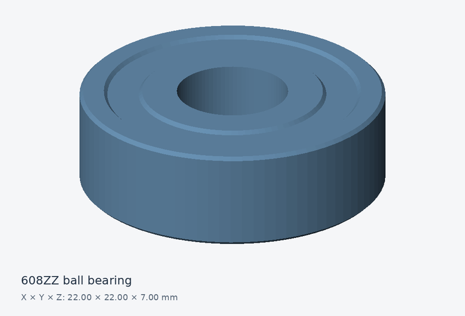

# 608ZZ ball bearing

A simplified bearing envelope for concentric geometry and assembly-clearance checks.

## Files and dimensions

| Format | Download |
| --- | --- |
| STEP | [Download STEP](https://github.com/cadprobs-a11y/cadprops-step-models/raw/refs/heads/main/parts/bearings-and-transmission/ball-bearing-608zz/ball-bearing-608zz.step) |
| STL | [Download STL](https://github.com/cadprobs-a11y/cadprops-step-models/raw/refs/heads/main/parts/bearings-and-transmission/ball-bearing-608zz/ball-bearing-608zz.stl) |
| IGES | [Download IGES](https://github.com/cadprobs-a11y/cadprops-step-models/raw/refs/heads/main/parts/bearings-and-transmission/ball-bearing-608zz/ball-bearing-608zz.iges) |

- Geometry envelope, X × Y × Z: **22.000 × 22.000 × 7.000 mm**.
- Loaded closed solids: **1**.
- CAD volume (sum of solids): **2242.934 mm³**.
- CAD surface area: **1319.558 mm²**.

Volume and area are calculated from STEP B-Rep geometry. They are inspection reference values; overlapping component volumes are not subtracted. STL is a tessellated approximation and contains no embedded length unit.

## Try an inspection

After downloading, use [STEP viewer](https://www.cadprops.com/tools/step-viewer/) to inspect this model and check units. Selecting a file uploads it for server processing. Viewing and measuring can start without an account.

## Source and license

- Original author: **Normand C**.
- License: **CC-BY-3.0**.
- Source: [original model](https://github.com/FreeCAD/FreeCAD-library/blob/544a254e090eaf7bfbb6a9b69e249dc0d3d29d67/Mechanical%20Parts/Bearings/608ZZ_Ball_Bearing.step).
- Original STEP SHA-256: `45246a4cf1bc63c8186ad8de22a74f44a63aecb450294356592c321bf281e3d3`.
- Changes: Original STEP bytes retained; STL, IGES and preview generated by CADProps from this STEP geometry.
- Authorship evidence: [upstream introduction commit](https://github.com/FreeCAD/FreeCAD-library/commit/a79401b6eca3614383264bd0244254d52fa7b6ec).
- Reuse: retain this author credit, source link, [CC BY 3.0](https://creativecommons.org/licenses/by/3.0/) notice and disclosure of changes.

Provided for learning and geometric inspection. Check your own tolerances, material, loads and manufacturing process before making a physical part.

[Back to the full parts catalog](../../../README.md)
