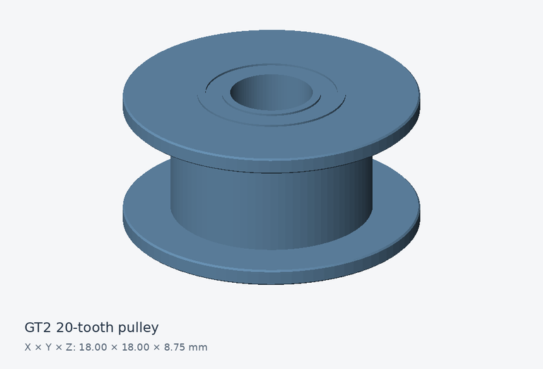

# GT2 20-tooth pulley

A toothed pulley with a smooth 5 mm bore for belt-drive layouts.

## Files and dimensions

| Format | Download |
| --- | --- |
| STEP | [Download STEP](https://github.com/cadprobs-a11y/cadprops-step-models/raw/refs/heads/main/parts/bearings-and-transmission/gt2-pulley-20t/gt2-pulley-20t.step) |
| STL | [Download STL](https://github.com/cadprobs-a11y/cadprops-step-models/raw/refs/heads/main/parts/bearings-and-transmission/gt2-pulley-20t/gt2-pulley-20t.stl) |
| IGES | [Download IGES](https://github.com/cadprobs-a11y/cadprops-step-models/raw/refs/heads/main/parts/bearings-and-transmission/gt2-pulley-20t/gt2-pulley-20t.iges) |

- Geometry envelope, X × Y × Z: **18.000 × 18.000 × 8.750 mm**.
- Loaded closed solids: **1**.
- CAD volume (sum of solids): **1112.494 mm³**.
- CAD surface area: **1248.342 mm²**.

Volume and area are calculated from STEP B-Rep geometry. They are inspection reference values; overlapping component volumes are not subtracted. STL is a tessellated approximation and contains no embedded length unit.

## Try an inspection

After downloading, use [CADProps STEP viewer](https://www.cadprops.com/tools/step-viewer/) to inspect this model and check units. Selecting a file uploads it for server processing. Viewing and measuring can start without an account.

## Source and license

- Original author: **Márcio Pessoa**.
- License: **CC-BY-3.0**.
- Source: [original model](https://github.com/FreeCAD/FreeCAD-library/blob/544a254e090eaf7bfbb6a9b69e249dc0d3d29d67/Mechanical%20Parts/Pulleys/GT2_20T_Smooth_5mm_Bore.step).
- Original STEP SHA-256: `f20d8de6ffe013061edd3d13e7f8e34df40ead68a5ac9c8b292decc1ae528d86`.
- Changes: Original STEP bytes retained; STL, IGES and preview generated by CADProps from this STEP geometry.
- Authorship evidence: [upstream introduction commit](https://github.com/FreeCAD/FreeCAD-library/commit/d9eb63b9709fd11ff20e12431905ab874eee9b14).
- Reuse: retain this author credit, source link, [CC BY 3.0](https://creativecommons.org/licenses/by/3.0/) notice and disclosure of changes.

Provided for learning and geometric inspection. Check your own tolerances, material, loads and manufacturing process before making a physical part.

[Back to the full parts catalog](../../../README.md)
