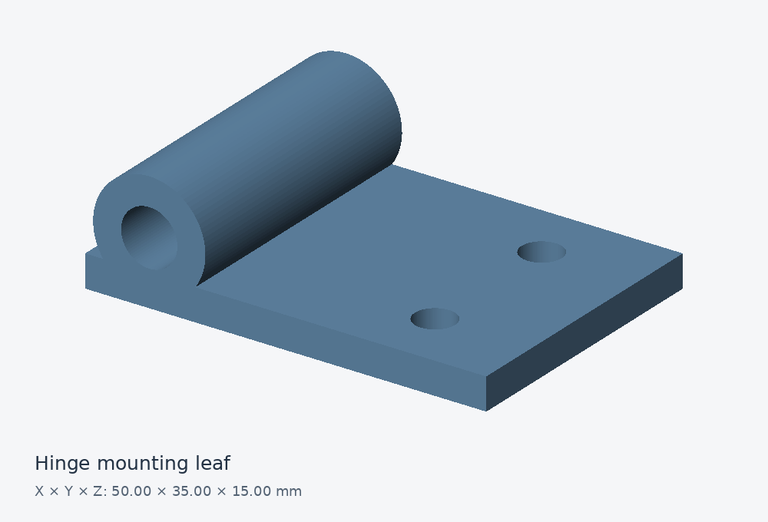

# Hinge mounting leaf

A 50 × 35 mm mounting leaf with a 7 mm hinge bore and two 5 mm mounting holes.

## Files and dimensions

| Format | Download |
| --- | --- |
| STEP | [Download STEP](https://github.com/cadprobs-a11y/cadprops-step-models/raw/refs/heads/main/parts/enclosures-and-plates/hinge-mounting-leaf/hinge-mounting-leaf.step) |
| STL | [Download STL](https://github.com/cadprobs-a11y/cadprops-step-models/raw/refs/heads/main/parts/enclosures-and-plates/hinge-mounting-leaf/hinge-mounting-leaf.stl) |
| IGES | [Download IGES](https://github.com/cadprobs-a11y/cadprops-step-models/raw/refs/heads/main/parts/enclosures-and-plates/hinge-mounting-leaf/hinge-mounting-leaf.iges) |

- Geometry envelope, X × Y × Z: **50.000 × 35.000 × 15.000 mm**.
- Loaded closed solids: **1**.
- CAD volume (sum of solids): **10037.258 mm³**.
- CAD surface area: **5844.959 mm²**.

Volume and area are calculated from STEP B-Rep geometry. They are inspection reference values; overlapping component volumes are not subtracted. STL is a tessellated approximation and contains no embedded length unit.

## Try an inspection

After downloading, use [CADProps STEP viewer](https://www.cadprops.com/tools/step-viewer/) to inspect this model and check units. Selecting a file uploads it for server processing. Viewing and measuring can start without an account.

## Source and license

- Original author: **CADProps**.
- License: **CC0-1.0**.
- Source: [original model](https://github.com/cadprobs-a11y/cadprops-step-models/blob/main/sources/original-parts.py).
- Original STEP SHA-256: `61284618f9de4d20b98f72c588d7bf8f490ee6913a89f76ff08bd80768caa28a`.
- Changes: Original procedural CAD model by CADProps; STEP, STL, IGES and preview generated from the same B-Rep geometry.
- Reuse: [CC0 1.0](https://creativecommons.org/publicdomain/zero/1.0/); no attribution is required.

Provided for learning and geometric inspection. Check your own tolerances, material, loads and manufacturing process before making a physical part.

[Back to the full parts catalog](../../../README.md)
