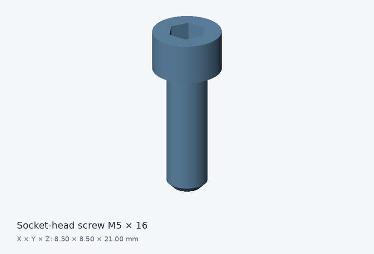

# Socket-head screw M5 × 16

A cap screw for studying a cylindrical head and recessed hex drive.

## Files and dimensions

| Format | Download |
| --- | --- |
| STEP | [Download STEP](https://github.com/cadprobs-a11y/cadprops-step-models/raw/refs/heads/main/parts/fasteners/socket-head-screw-m5x16/socket-head-screw-m5x16.step) |
| STL | [Download STL](https://github.com/cadprobs-a11y/cadprops-step-models/raw/refs/heads/main/parts/fasteners/socket-head-screw-m5x16/socket-head-screw-m5x16.stl) |
| IGES | [Download IGES](https://github.com/cadprobs-a11y/cadprops-step-models/raw/refs/heads/main/parts/fasteners/socket-head-screw-m5x16/socket-head-screw-m5x16.iges) |

- Geometry envelope, X × Y × Z: **8.500 × 8.500 × 21.000 mm**.
- Loaded closed solids: **1**.
- CAD volume (sum of solids): **535.431 mm³**.
- CAD surface area: **546.939 mm²**.

Volume and area are calculated from STEP B-Rep geometry. They are inspection reference values; overlapping component volumes are not subtracted. STL is a tessellated approximation and contains no embedded length unit.

## Try an inspection

After downloading, use [fasteners inspection](https://www.cadprops.com/tools/cad-dimensions/) to inspect this model and check units. Selecting a file uploads it for server processing. Viewing and measuring can start without an account.

## Source and license

- Original author: **Peta-T**.
- License: **CC-BY-3.0**.
- Source: [original model](https://github.com/FreeCAD/FreeCAD-library/blob/544a254e090eaf7bfbb6a9b69e249dc0d3d29d67/Mechanical%20Parts/Fasteners/Bolts%20%26%20Screws/Metric/ISO4762%20Hexagon%20socket%20head%20cap%20screws/Screw%20M5x16%20ISO4762%208%2C8%20A2K.step).
- Original STEP SHA-256: `ca43186249d56c10684d87e162b6b5ae305a294957574adb6f904a3b0266e6a8`.
- Changes: Original STEP bytes retained; STL, IGES and preview generated by CADProps from this STEP geometry.
- Authorship evidence: [upstream introduction commit](https://github.com/FreeCAD/FreeCAD-library/commit/56eb42e64b7f7204c21167f7f6e4057081be7550).
- Reuse: retain this author credit, source link, [CC BY 3.0](https://creativecommons.org/licenses/by/3.0/) notice and disclosure of changes.

Provided for learning and geometric inspection. Check your own tolerances, material, loads and manufacturing process before making a physical part.

[Back to the full parts catalog](../../../README.md)
