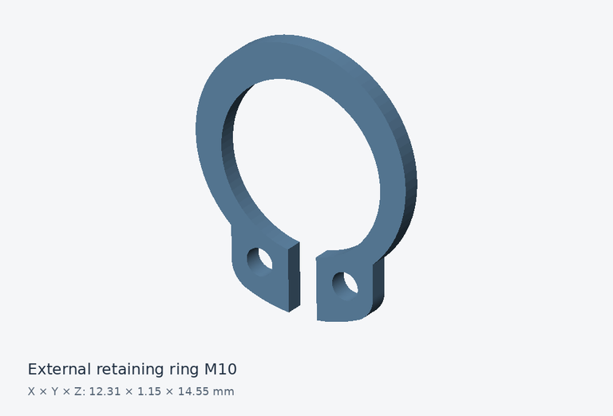

# External retaining ring M10

A retaining ring with an open segment and installation eyes.

## Files and dimensions

| Format | Download |
| --- | --- |
| STEP | [Download STEP](https://github.com/cadprobs-a11y/cadprops-step-models/raw/refs/heads/main/parts/sleeves-and-washers/external-retaining-ring-m10/external-retaining-ring-m10.step) |
| STL | [Download STL](https://github.com/cadprobs-a11y/cadprops-step-models/raw/refs/heads/main/parts/sleeves-and-washers/external-retaining-ring-m10/external-retaining-ring-m10.stl) |
| IGES | [Download IGES](https://github.com/cadprobs-a11y/cadprops-step-models/raw/refs/heads/main/parts/sleeves-and-washers/external-retaining-ring-m10/external-retaining-ring-m10.iges) |

- Geometry envelope, X × Y × Z: **12.309 × 1.147 × 14.550 mm**.
- Loaded closed solids: **1**.
- CAD volume (sum of solids): **61.509 mm³**.
- CAD surface area: **208.473 mm²**.

Volume and area are calculated from STEP B-Rep geometry. They are inspection reference values; overlapping component volumes are not subtracted. STL is a tessellated approximation and contains no embedded length unit.

## Try an inspection

After downloading, use [CADProps sleeves & washers inspection](https://www.cadprops.com/tools/cad-surface-area/) to inspect this model and check units. Selecting a file uploads it for server processing. Viewing and measuring can start without an account.

## Source and license

- Original author: **nachotineo**.
- License: **CC-BY-3.0**.
- Source: [original model](https://github.com/FreeCAD/FreeCAD-library/blob/544a254e090eaf7bfbb6a9b69e249dc0d3d29d67/Mechanical%20Parts/Fasteners/RetainingRings/Metric/DIN471_CLASS_A_M10RetainingRings.step).
- Original STEP SHA-256: `33cbdfc2e7884233c66b9d792b4e9a9dc4985966d7551c71d86f45d522ff3e8d`.
- Changes: Original STEP bytes retained; STL, IGES and preview generated by CADProps from this STEP geometry.
- Authorship evidence: [upstream introduction commit](https://github.com/FreeCAD/FreeCAD-library/commit/c4691137740fc539d6076dbf5b384fb554b5251b).
- Reuse: retain this author credit, source link, [CC BY 3.0](https://creativecommons.org/licenses/by/3.0/) notice and disclosure of changes.

Provided for learning and geometric inspection. Check your own tolerances, material, loads and manufacturing process before making a physical part.

[Back to the full parts catalog](../../../README.md)
