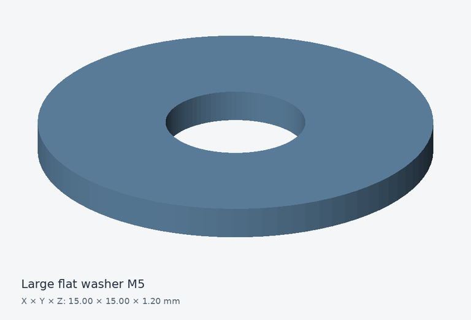

# Large flat washer M5

A wide annular washer for examining bearing surfaces.

## Files and dimensions

| Format | Download |
| --- | --- |
| STEP | [Download STEP](https://github.com/cadprobs-a11y/cadprops-step-models/raw/refs/heads/main/parts/sleeves-and-washers/large-flat-washer-m5/large-flat-washer-m5.step) |
| STL | [Download STL](https://github.com/cadprobs-a11y/cadprops-step-models/raw/refs/heads/main/parts/sleeves-and-washers/large-flat-washer-m5/large-flat-washer-m5.stl) |
| IGES | [Download IGES](https://github.com/cadprobs-a11y/cadprops-step-models/raw/refs/heads/main/parts/sleeves-and-washers/large-flat-washer-m5/large-flat-washer-m5.iges) |

- Geometry envelope, X × Y × Z: **15.000 × 15.000 × 1.200 mm**.
- Loaded closed solids: **1**.
- CAD volume (sum of solids): **185.583 mm³**.
- CAD surface area: **385.835 mm²**.

Volume and area are calculated from STEP B-Rep geometry. They are inspection reference values; overlapping component volumes are not subtracted. STL is a tessellated approximation and contains no embedded length unit.

## Try an inspection

After downloading, use [CADProps sleeves & washers inspection](https://www.cadprops.com/tools/cad-surface-area/) to inspect this model and check units. Selecting a file uploads it for server processing. Viewing and measuring can start without an account.

## Source and license

- Original author: **nachotineo**.
- License: **CC-BY-3.0**.
- Source: [original model](https://github.com/FreeCAD/FreeCAD-library/blob/544a254e090eaf7bfbb6a9b69e249dc0d3d29d67/Mechanical%20Parts/Fasteners/Washers/Metric/ISO7093DIN9021_M5FlatWasher.step).
- Original STEP SHA-256: `a277e642a5c5ae214b42d729c63b660d949fad13ef501fcb4c8e89c3bf0adefc`.
- Changes: Original STEP bytes retained; STL, IGES and preview generated by CADProps from this STEP geometry.
- Authorship evidence: [upstream introduction commit](https://github.com/FreeCAD/FreeCAD-library/commit/9e1fb91dffe743aed6855b9cb45d5da6fa43e32a).
- Reuse: retain this author credit, source link, [CC BY 3.0](https://creativecommons.org/licenses/by/3.0/) notice and disclosure of changes.

Provided for learning and geometric inspection. Check your own tolerances, material, loads and manufacturing process before making a physical part.

[Back to the full parts catalog](../../../README.md)
